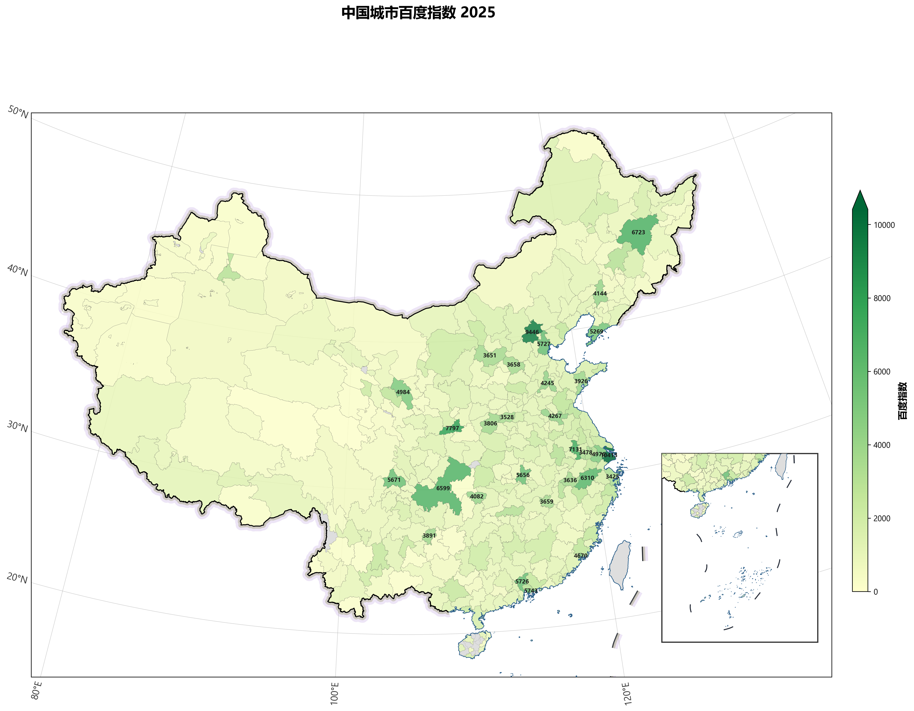
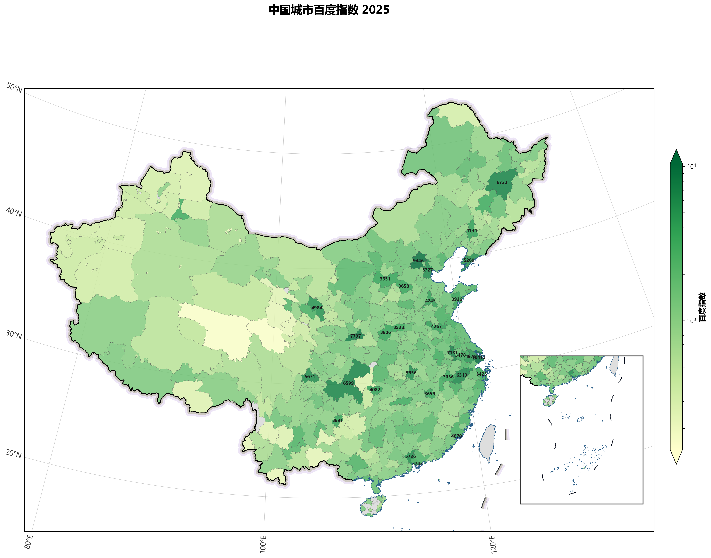

# 中国省市县分级地图绘制

读取 CSV 数值数据，叠加省市县三级地理信息，绘制中国分级统计地图（含南海九段线插图）。

## 🚀 快速开始

```bash
# 1. 安装依赖
uv sync

# 2. 在 CSV 中填好数据（见下文「数据格式」）
# 3. 运行
uv run python draw_map.py
```

### 运行模式

```bash
uv run python draw_map.py          # 省级地图
uv run python draw_map.py 市       # 地级市地图
uv run python draw_map.py 县       # 县级地图
```

## 📊 数据格式

每个 CSV 只需要两列：

| city_name | index_value |
|-----------|-------------|
| 北京市    | 869         |
| 河南省    | 7370        |
| …         | …           |

各模式对应文件：

| 模式 | CSV 文件 | 区域数 |
|------|----------|--------|
| 省   | `province_data.csv` | 34 |
| 市   | `city_data.csv`     | 375 |
| 县   | `county_data.csv`   | ~3000 |

只保留 `index_value > 0` 的行，缺失值或 ≤0 的区域在地图上显示为灰色。

## ⚙️ 配置

所有配置集中在文件顶部，日常只需关注一个位置：

```python
config = MapConfig(
    mode='省',                      # 省 / 市 / 县
    scale='linear',                 # linear（线性）/ log（对数）
    n_top=30,                       # 标注前 N 个高值区域

    # 想换颜色时取消注释：
    # colors=['#ffffcc', '#c2e699', '#78c679', '#31a354', '#006837'],

    # 想固定数值范围时取消注释：
    # value_min=100,
    # value_max=20000,
)
```

也可以用命令行临时覆盖模式：
```bash
uv run python draw_map.py 市
```

### 完整参数

| 参数 | 默认值 | 说明 |
|------|--------|------|
| `mode` | `'省'` | 绘图级别：省 / 市 / 县 |
| `scale` | `'linear'` | 色阶类型：`linear`（线性）/ `log`（对数） |
| `n_top` | `30` | 标注前 N 个高值区域 |
| `colors` | 黄绿渐变色 | 颜色方案（5 色列表） |
| `value_min` | `None` | 固定范围最小值（None = 自动） |
| `value_max` | `None` | 固定范围最大值（None = 自动） |
| `log_ticks` | `[200, 500, 1000, 2000, 5000, 10000]` | 对数色阶刻度（仅 `scale='log'` 时生效） |
| `label` | `'value'` | 色标标签文字 |

以下参数一般无需改动：`gis_dir`, `map_extent`, `inset_extent`, `figsize`, `dpi`, `no_data_color/edge`, `boundary_color`, `coastline_color`, `ten_line_color`。

## 📁 项目结构

```
├── draw_map.py           # 主脚本（配置 + 绘图逻辑）
├── pyproject.toml        # 项目依赖
├── uv.lock
├── province_data.csv     # 省级数据
├── city_data.csv         # 地级市数据
├── county_data.csv       # 县级数据
└── gis_data/             # 地理底图 Shapefile
    ├── 中国_省.shp
    ├── 中国_市.shp
    ├── 中国_县.shp
    ├── 十段线_换向.shp
    ├── 陆地边界.shp
    └── 海界.shp
```

## 🗺️ 输出示例

运行后生成高精度 PNG（默认 300 DPI）：

- `省级地图.png`
- `地级市地图.png`
- `县级地图.png`

### 效果图


*线性色阶（正常）效果*


*对数色阶效果*

包含：主地图 + 南海九段线插图 + 分级色阶图例 + TOP N 数值标注 + 经纬网格。

## 📦 依赖

- Python ≥ 3.12
- geopandas — 地理数据处理
- matplotlib — 绘图
- cartopy — 地图投影与网格
- pandas — 数据处理

通过 `uv sync` 自动安装。
